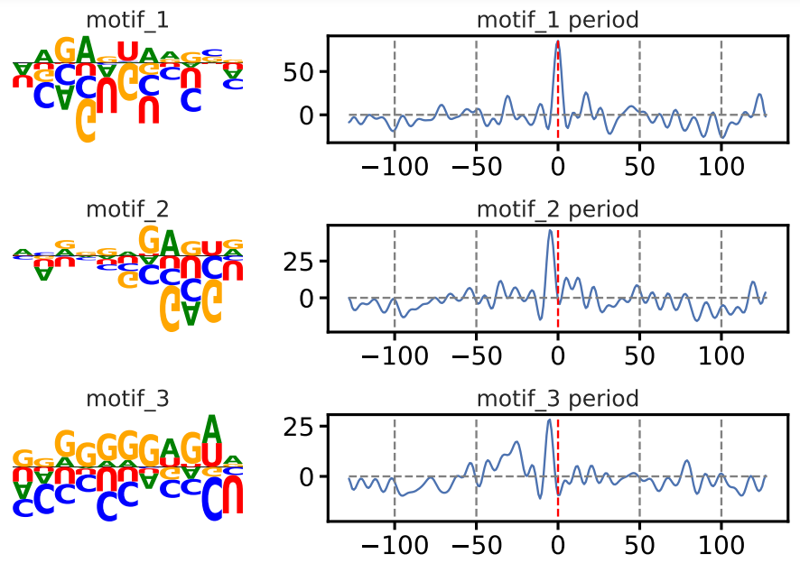
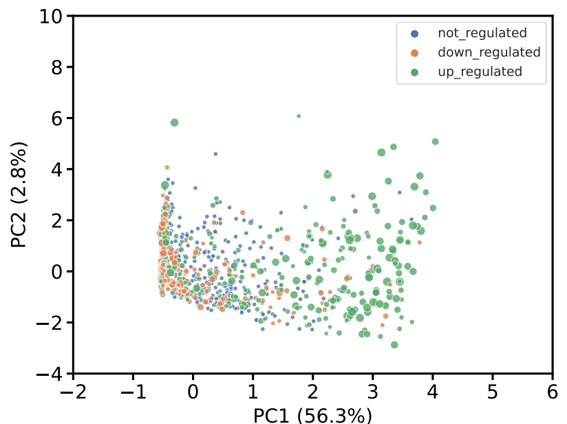

## Pipeline usage

### Environment preparation
you can install either install only `torch==1.12` by pip or use conda for full environment clone.

```bash
conda env create -f env.yml
conda activate motifNet

python test_env.py

```

`test_env.py` will tell whether your environment has been installed sucessfully.

### Data Preparation
Prepare your sequencing data table with `seq' and 'label' columns: 

| seq    | label |
| ------ | ----- |
| ATTCTT | 0     |
| ATTCTT | 1     |
| ATTCTT | 0     |
| ATTCTT | 1     |

### Train

```bash
python main.py train -i data/artificialMotifSeqSet.csv --seq_len 500 --prefix fake_data --task binary_classification

If you want to split train and validation, for example by leaving some chromosomes for validation.
Simply modify preprocess.py to your needs and provide an extra `-v test.csv`. Otherwise -i input table will be taken as evaluation data.


## Data visualization
After the model was trained, ranked motif logos plot and PCA of splicing junction sequence feature can be generated by script `draw_results`.

```bash
python draw_results.py -i data/artificialMotifSeqSet.csv --prefix fake --ckpt ckpt/sinTrainer/fake_data_5.pth --seq_len 500 --color_by label --task binary_classification
```

### ranked motif logos


### PCA plot



### inference 
If you just want to look into some some specific genes sequences, you can use the following pipeline to generate predict delta psi and motif fingerprint.

```bash
python predict_seq.py -i data/artificialMotifSeqSet.csv --prefix fake --ckpt ckpt/sinTrainer/fake_data_5.pth --seq_len 500 --task binary_classification
```


```python
fingerprint = np.load('results/output.npy')
print(fingerprint.shape)

Out[4]: (10, 256, 32)
```
where 10 is number of rows in seq.csv, 256 is the length of sequences and 32 the number of motifs.

